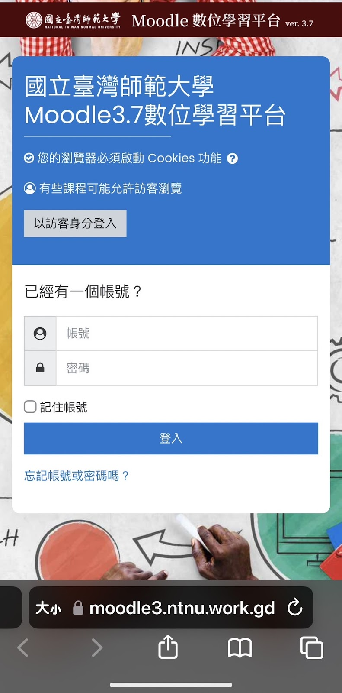

# NTNU Moodle 釣魚網站（Phishing Demo）

📎 **Demo 網址**: [https://ntnu.work.gd](https://ntnu.work.gd)




## 🧠 專案簡介

本專案為資安教育用途所製作的釣魚網站模擬，仿造 NTNU Moodle 登入頁面，蒐集使用者輸入的帳號與密碼後，**紀錄至 `user_input_log.txt`**，並自動重新導向至 Moodle 官方網站：

🔗 [https://moodle3.ntnu.edu.tw/login/index.php](https://moodle3.ntnu.edu.tw/login/index.php)


## 📂 專案結構

- `phishing_data.csv`：釣魚網站使用情境調查問卷結果資料檔（供使用者參考）。
- `moodle/`：包含前端頁面與 `back.py` 的執行目錄。
- `back.py`：主要後端伺服器，接收 GET / POST 請求並記錄使用者輸入至 `user_input_log.txt`。
- `index.html`：釣魚網站前端
- `ntnu_moodle.conf`：Nginx 設定檔，需搭配使用以部署網站。


## 🚀 啟動方式

### 本地啟動

請先進入 `moodle` 資料夾，再執行以下指令啟動後端程式：

```bash
cd moodle
nohup python3 back.py & 
```

## 🔐 免費 SSL 安裝（Let's Encrypt + Certbot）

透過 **Let's Encrypt** 免費 SSL 憑證保障網站安全性。

### ① 安裝 Certbot（以 Ubuntu 為例）

```bash
sudo apt update
sudo apt install certbot python3-certbot-nginx
```

### ② 設定 Nginx 並取得 SSL 憑證
將提供的 ntnu_moodle.conf 放至 Nginx 的設定資料夾：

```bash
sudo ln -s /path/to/ntnu_moodle.conf /etc/nginx/sites-enabled/
sudo nginx -t
sudo systemctl reload nginx
sudo certbot --nginx -d ntnu.work.gd
```

## 📊 資料檔案說明 (phishing_data.csv)
專案提供一份名為 phishing_data.csv 的問卷調查資料檔案，內容為釣魚攻擊認知之調查統計結果，供學習參考與進一步分析使用。

